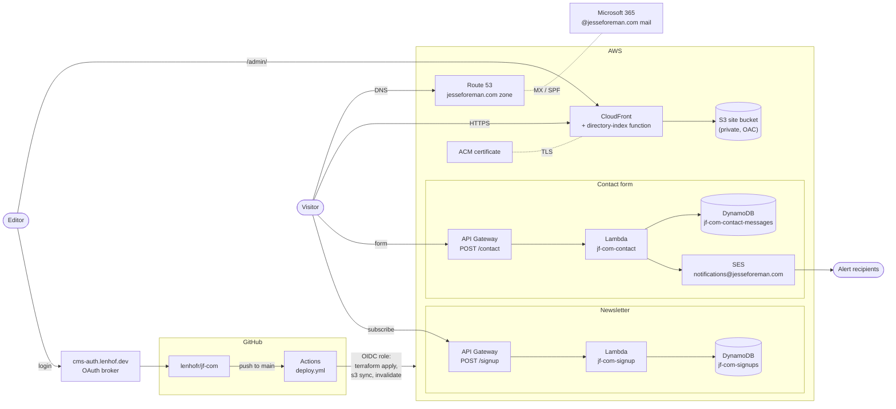
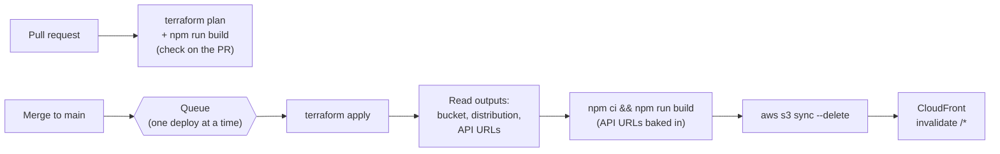

# jf-com

Source for **[jesseforeman.com](https://jesseforeman.com)**, the site of Jesse L.
Foreman, Esq. (attorney and NFLPA Certified Contract Advisor).

- **Frontend:** Vite + React + TypeScript + Tailwind single-page app in `frontend/`.
- **Hosting:** S3 behind CloudFront, managed with Terraform in `infra/terraform/`.
- **Forms:** two small serverless APIs (contact form and newsletter signup),
  each API Gateway → Lambda → DynamoDB. Contact messages are also emailed through SES.
- **Blog:** markdown in `content/blog/`, edited through Decap CMS at `/admin/`.
- **Deploys:** every merge to `main` runs Terraform and ships the site through
  GitHub Actions.

## Contents

- [Repository layout](#repository-layout)
- [Run locally](#run-locally)
- [Architecture](#architecture)
- [Deploys](#deploys)
- [Blog content and the CMS](#blog-content-and-the-cms)
- [Contact form and newsletter](#contact-form-and-newsletter)
- [Page titles, link previews, and SEO](#page-titles-link-previews-and-seo)
- [Design](#design)
- [Specs (OpenSpec)](#specs-openspec)

## Repository layout

| Path                                      | What it is                                                                               |
| ----------------------------------------- | ---------------------------------------------------------------------------------------- |
| `frontend/`                               | The React app. Page copy lives in `src/data/site.ts`; per-page SEO in `src/data/seo.ts`. |
| `frontend/public/admin/`                  | Decap CMS (`config.yml` + the preview page). Served at `/admin/`.                        |
| `frontend/scripts/generate-posts.mjs`     | Compiles `content/blog/*.md` into `posts.generated.json` and validates it.               |
| `frontend/vite-plugins/prerender-meta.ts` | Writes a per-route `index.html` with that page's meta tags, and `sitemap.xml`.           |
| `content/blog/`                           | Blog posts, one markdown file each ([schema](content/README.md)).                        |
| `infra/terraform/`                        | All AWS infrastructure. `lambda/` holds the two Python handlers.                         |
| `.github/workflows/deploy.yml`            | Plan and build on pull requests; apply and deploy on `main`.                             |
| `openspec/`                               | Specs for the forms and infrastructure, and the change history.                          |
| `docs/`                                   | Design handoff, mockups, and older planning notes ([index](docs/README.md)).             |

## Run locally

Needs **Node 22** (what CI uses) and npm.

```bash
cd frontend
npm ci
npm run dev       # http://localhost:5173
```

Other scripts:

```bash
npm run build           # production build into dist/ (also generates posts, sitemap, per-page HTML)
npm run preview         # serve dist/
npm run lint
npm run generate:posts  # rebuild posts.generated.json on its own
```

`posts.generated.json` is gitignored. On a fresh clone, run `npm run dev` or
`npm run generate:posts` once, or the TypeScript import will not resolve in your
editor.

**Forms in local dev.** The contact and newsletter forms read their API URLs
from `VITE_CONTACT_API_URL` and `VITE_SIGNUP_API_URL`. Without them, the forms
show a "not configured" message instead of submitting. To test against the live
APIs, put them in `frontend/.env` (gitignored). The APIs accept browser
requests from `http://localhost:5173`, which is why the dev server uses that
port. The values are the Terraform
outputs `contact_api_base_url` and `signup_api_base_url`, also printed in every
deploy log. Anything you submit lands in the real tables, and contact messages
email the real recipients.

## Architecture



What each piece does:

- **CloudFront + S3.** The built app sits in a private bucket that only
  CloudFront can read. A CloudFront function rewrites `/legal` and `/legal/` to
  `/legal/index.html` (the prerendered copy for that route) and redirects
  `/admin` to `/admin/`. Anything with no file behind it falls through to
  `/index.html`, and the React router takes over, including its 404 page.
  Hashed files under `/assets/` are cached for a long time; everything else
  briefly.
- **DNS.** Route 53 hosts the zone; GoDaddy is only the registrar. Email for the
  domain is **Microsoft 365**, so the MX, SPF, and autodiscover records in
  `main.tf` point there. SES adds its own DKIM records and a
  `mail.jesseforeman.com` bounce domain without touching those.
- **Forms.** Two independent APIs, each with its own table. Both allow browser
  requests from jesseforeman.com, www, and `localhost:5173`, and are rate
  limited at API Gateway. See [Contact form and newsletter](#contact-form-and-newsletter).
- **CI access.** GitHub Actions assumes an AWS role through OIDC, so there are no
  stored AWS keys. Terraform state is in the shared bucket
  `tf-state-common-217354297026-us-east-1`.

Everything is in **us-east-1**.

## Deploys



- **Every merge to `main` deploys,** including CMS merges and CMS deletes.
- **Deploys queue** (`concurrency` in `deploy.yml`). Each one ends with
  `s3 sync --delete`, so two running at once delete each other's files and leave
  a blank site. That happened on 2026-09-30 when several CMS deletions landed
  within a minute. If more merges arrive while one is running, only the newest
  waits, which is fine because it builds the latest `main`.
- **API URLs come from Terraform outputs,** not repository variables. A stale
  variable once pointed the newsletter at a deleted API for months.
- **Pull requests (including CMS ones) get a `terraform` check** that runs
  `terraform plan` and builds the site. A post with bad frontmatter fails that
  check instead of breaking `main`. That gap stopped every deploy for a few
  hours on 2026-09-30. For infrastructure changes, read the plan in the check's
  log before merging.

## Blog content and the CMS

Posts are markdown with frontmatter in [`content/blog/`](content/README.md),
which has the full schema. They live at the repo root, not in `frontend/`,
because that is where Decap's GitHub backend commits.

- **Editing:** Jesse edits at <https://jesseforeman.com/admin/>, logging in with
  GitHub through the shared OAuth broker (`cms-auth.lenhof.dev`, deployed from
  `lenhofr/cms-oauth`). Who may edit is simply who has write access to this repo.
- **Review:** saving opens a pull request on a `cms/…` branch
  (`publish_mode: editorial_workflow`). Nothing goes live until it is merged.
  **Exception: deleting a published post commits straight to `main`** and
  deploys immediately.
- **Images:** uploads go to `frontend/public/images/blog/`. Decap processes
  them in the browser first (`media_processing` in `config.yml`): centre-cropped
  to 1200×630 and saved as JPEG, which is also the size link previews use.
  Images added outside the CMS are not processed.
- **Categories:** Sports / Law / Business / Technology. They are defined in
  `postCategories` in `frontend/src/data/site.ts` and must match the dropdown in
  `frontend/public/admin/config.yml`; the build fails if they differ. Filters on
  `/blog` only show categories that have posts.

`generate-posts.mjs` runs automatically before `npm run dev` and
`npm run build`. It is the only validation posts get, so it is strict: missing
or malformed frontmatter fails the build with every problem listed. Dates are
stored as `2026-03-12` and shown as "March 2026".

The CMS preview pane (`frontend/public/admin/index.html`) hand-copies the post
page's markup and date formatting, because it cannot import from the app. If
you restyle `BlogPost.tsx`, update it too.

## Contact form and newsletter

|              | Contact ("Send a note" on `/contact`)                | Newsletter (Home, Insights, Blog, posts) |
| ------------ | ---------------------------------------------------- | ---------------------------------------- |
| Endpoint     | `POST /contact`                                      | `POST /signup`                           |
| Lambda       | `jf-com-contact`                                     | `jf-com-signup`                          |
| Table        | `jf-com-contact-messages` (one row per message)      | `jf-com-signups` (one row per email)     |
| Stored       | name, email, subject (the topic), message, timestamp | email, first and latest signup time      |
| Notification | **Email to every address in `contact_alert_to`**     | none                                     |

- **Alerts.** Each stored contact message is emailed from
  `Jesse Foreman <notifications@jesseforeman.com>` with the visitor as
  **Reply-To**, so replying answers them directly.
- **Changing recipients.** Recipients are the `contact_alert_to` list in
  `infra/terraform/contact_alerts.tf`; edit the list and merge.
  `rob.j.len@gmail.com` is on it **temporarily** for testing.
- **Failures.** Sending is best effort. The message is saved first, and a failed
  send logs `CONTACT_ALERT_FAILED id=…` to CloudWatch (never the message body)
  while the visitor still sees success. If alerts stop arriving, check the
  Lambda's logs and SES in us-east-1.
- **Phone numbers.** The contact form has no phone column, so the number is
  appended to the message as `Phone: …`.
- **Spam.** Both forms carry a hidden honeypot field, and a filled one is
  rejected.
- **Reading data.** There is no admin UI. Read or export submissions from the
  DynamoDB console.

## Page titles, link previews, and SEO

Crawlers that build link previews (iMessage, Slack, Facebook, LinkedIn) do not
run JavaScript, so a single-page app would otherwise preview every URL as the
homepage.

- **One source of truth:** `frontend/src/data/seo.ts` holds the title,
  description, and share image for every page, and derives them for each blog
  post.
- **At build time:** `vite-plugins/prerender-meta.ts` writes
  `dist/<route>/index.html` for every page and published post, with those tags
  already in the `<!-- page-meta -->` block. It also writes `sitemap.xml`.
- **In the browser:** `SiteLayout` updates the same tags on every navigation.
- **Share images:** the default is `frontend/public/og-image.jpg` (1200×630). A
  post with an `image` uses its own.
- **Adding a page:** add its route to `App.tsx` and an entry to `pageMeta` in
  `seo.ts`. The prerender, sitemap, and runtime tags follow automatically.

## Design

The brand is black, gold, silver, grey, and white, with the lion-shield logo,
from the September 2026 design handoff in
[`docs/design-handoff/README.md`](docs/design-handoff/README.md).

- **Colours** are Tailwind tokens in `frontend/tailwind.config.ts` (`charcoal`,
  `gold`, `champagne`, `silver`, `grey`, `ink`, `paper`). Small gold text on
  light backgrounds uses `gold-dark` for contrast.
- **Shared building blocks** (buttons, eyebrows, the hero photo, the quote
  carousel, FAQ lists) are in `frontend/src/components/site/ui.tsx`.
- **Generated art.** Slots without a photograph (blog posts without an image,
  statement panels, the About page role tiles) render generated SVG art from
  `components/site/art.tsx`. It is deterministic, so a post's card and banner
  always match. Pass `src` to `ImageSlot` to use a real photo instead.

## Specs (OpenSpec)

`openspec/specs/` describes the contact form, the newsletter signup, and the
AWS region. Changes to how any of those behave go through an OpenSpec change
proposal first; see [`openspec/AGENTS.md`](openspec/AGENTS.md). Finished changes
are in `openspec/changes/archive/`.
